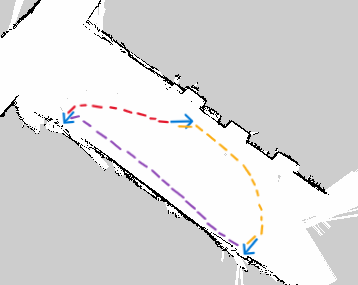

# IntelliCruise Fetch & Delivery项目 README

本项目基于 ros noetic 开发，实现**语音交互控制、五自由度机械臂运动、室内地图建图、自主导航避障、抓取放置全自动任务**一体化功能。

项目仅开源**自主开发核心功能包**，官方公共依赖包可直接通过环境配置复现。

## 机器人自主导航作业轨迹演示


上图展示机器人三点循环自主导航路线：起点→中间途经点→终点折返
---
## 📁 项目核心结构

仓库仅包含本组编写、修改、适配的核心业务包，其余 TurtleBot 官方依赖、工具依赖均为公共开源包按需配置

```Plain Text
FinalProject
├── my_dynamixel      # 舵机机械臂控制核心包（点位控制、话题运动、初始化脚本）
├── my_navigation     # 机器人建图、定位、自主导航、仿真任务包
├── robot_voice       # 全套语音交互包（语音识别、TTS播报、指令解析、总控调度）
├──CMakeLists.txt    #catkin编译配置文件
├──Lab Report.pdf   #项目报告
├──Presentation_Slides.pptx  #展示幻灯片
├──README.md    #说明文档
├──my_home_map.pgm   #室内地图灰度图片文件
├──my_home_map.yaml   #地图配套参数配置文件
```

## 🔧 运行环境依赖

### 1\. 系统与ROS版本

- 操作系统：**Ubuntu 20\.04 LTS**

- ROS 版本：**ROS Noetic**

- 编译工具：catkin

### 2\. 系统依赖库

用于语音录音、机械臂驱动、导航运行

```Plain Text
# 完整系统依赖安装（Ubuntu20.04 + ROS Noetic 专属适配）
sudo apt update && sudo apt upgrade -y

# ALSA音频依赖（robot_voice 录音底层必需）
sudo apt install -y libasound2-dev libasound2

# Dynamixel机械臂驱动依赖（Noetic适配）
sudo apt install -y ros-noetic-dynamixel-workbench ros-noetic-dynamixel-sdk

# TurtleBot全套底盘、仿真、驱动依赖
sudo apt install -y ros-noetic-turtlebot ros-noetic-turtlebot3*
sudo apt install -y ros-noetic-kobuki-*
sudo apt install -y ros-noetic-yocs-*

# 导航全套核心依赖
sudo apt install -y ros-noetic-amcl ros-noetic-map-server ros-noetic-move-base
sudo apt install -y ros-noetic-navigation ros-noetic-base-local-planner ros-noetic-dwa-local-planner

# Gazebo仿真环境依赖
sudo apt install -y ros-noetic-gazebo-ros ros-noetic-gazebo-ros-control

# 深度相机依赖（freenect_stack）
sudo apt install -y ros-noetic-freenect-stack libfreenect-dev

# ROS基础消息与核心依赖
sudo apt install -y ros-noetic-roscpp ros-noetic-rospy ros-noetic-std_msgs
sudo apt install -y ros-noetic-geometry-msgs ros-noetic-nav-msgs ros-noetic-sensor-msgs

# 编译工具链
sudo apt install -y build-essential cmake gcc g++
```

### 3\. Python 依赖

```Plain Text
# Ubuntu20.04 专属 Python3 依赖、
sudo apt install -y python3-pip python3-dev
sudo pip3 install --upgrade pip
sudo pip3 install pyserial threading
```

### 4\. ROS公共依赖包

项目运行依赖以下官方公共包，本地环境安装即可，**不纳入仓库上传范围**：

- turtlebot 全套底盘、仿真、可视化依赖

- freenect\_stack、libfreenect（深度相机依赖）

- kobuki 底盘驱动系列包

- yocs 速度平滑、指令复用控制包

- gazebo\_ros 仿真环境

- **amcl、map\_server、move\_base 导航全套核心包**（定位、地图加载、路径规划、避障核心）

## 📌 硬件设备要求

- Dynamixel AX12 五自由度机械臂

- TurtleBot 移动底盘

- 麦克风、音响（语音交互必备）

- USB 串口设备
## ⚙️ 项目编译步骤
### 1\. 创建工作空间

```Plain Text
mkdir -p ~/catkin_ws/src
cd ~/catkin_ws/src
```

### 2\. 克隆核心源码

将本仓库放入 src 目录
### 3\. 赋予脚本执行权限（必须操作）

```Plain Text
# 机械臂脚本权限
chmod +x ~/catkin_ws/src/my_dynamixel/scripts/*.py
# 语音脚本权限
chmod +x ~/catkin_ws/src/robot_voice/scripts/*.py
```

### 4\. 编译项目

```Plain Text
cd ~/catkin_ws
catkin_make
source devel/setup.bash
```

## 🚀 项目启动指令

### 1\. 系统入口：终端执行以下命令

```Plain Text
roslaunch robot_voice voice_total.launch
```


## 🎯 项目核心功能

1. **语音交互**：麦克风拾音识别、文字语音播报、自然语言指令解析

2. **机械臂控制**：单关节精准点位控制、初始化复位、抓取、下放、预抓取

3. **自主导航**：室内地图加载、AMCL定位、动态避障、定点巡航

4. **全自动任务**：语音触发 → 导航到位 → 机械臂抓取 → 导航归位 → 放置复位
